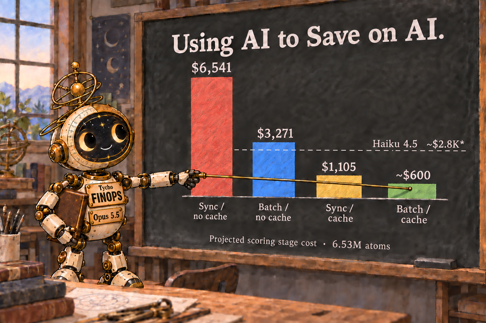

> Canonical reading experience: https://www.inflect-ai.com/notes/using-ai-to-save-on-ai

# Using AI to Save on AI

I built an AI agent to help me spend less on AI. His name is Tycho, and he runs on Opus 5.5. Four days after I made him our FinOps agent, he found a way to cut the projected cost of one scoring job from $6,541 to about $600.[^1]

Haiku was the default model we had chosen for this task. Tycho's job was to see if we could lower the cost even more. He tested DeepSeek for a scoring run of roughly 6.5 million calls. Each call sent the same 2,800 tokens of prompting instructions. Without a working cache, we would pay to process those instructions millions of times. Tycho's first test showed that the cache was not reusing them at all. Identical requests came back with zero cached tokens. No error, just the ordinary price.

Tycho traced the miss to the routing. Identical calls were landing on different servers, and each server kept its own cache. He made the calls return to the same server. The next test reused the instructions.[^2] That one fix brought the projected DeepSeek bill from $6,541 to $1,105. Then Tycho checked whether we could keep the cache working while also getting a batch discount. We could. The projection fell to about $600. Same model, same job. Tycho had found a way to stop paying full price for the same instructions millions of times.

I put an expensive model in charge of finding out where I could spend less on AI. My FINOPs agent, running Opus 5.5, chose a non-Anthropic model, and then optimized a competitor's product so the final cost was 5x cheaper than Haiku. Anthropic and OpenAI are offering frontier intelligence. But that very intelligence can now be used to figure out how to spend less money on the frontier labs.

[^1]: The full-job costs are extrapolated from small probes; the job has not been run or billed at this size. Haiku 4.5 was our original scoring model, before production moved to Gemini in June. Its earlier, longer rubric was padded to clear the cache minimum. A 300-atom probe recorded 98.6% cache hits, and 43,747 Haiku-scored atoms averaged $0.000426 per atom. The chart extends that rate to 6.53 million atoms, about $2.8K. The four DeepSeek bars use a newer rubric.

[^2]: Fireworks' prompt cache is replica-local. Without session affinity, four identical calls reported no cached tokens. With affinity, five warm calls reported 2,812 cached tokens out of roughly 2,960 input tokens each. An eight-request batch reported 19,688 cached tokens of 23,677, consistent with one cold prefix and seven warm hits. These were small probes, not a full production run. Batch alone was projected at $3,271; the chart shows all four price points.
